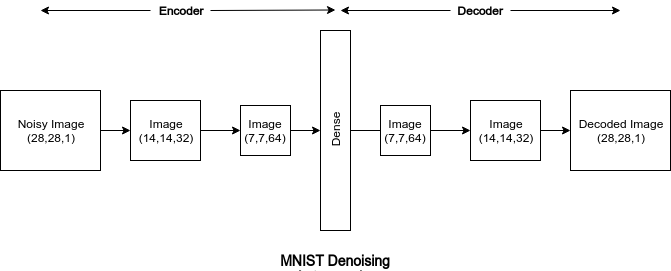

# MNIST-denoising-autoencoder
A tutorial of Denoising Autoencoder which removes noise from MNIST images.

## AutoEncoder
Autoencoder is an unsupervised artificial neural network that learns how to efficiently compress and encode data then learns how to reconstruct the data back from the reduced encoded representation to a representation that is as close to the original input as possible.

Autoencoder, by design, reduces data dimensions by learning how to ignore the noise in the data.

### Components
1. Encoder : In which the model learns how to reduce the input dimensions and compress the input data into an encoded representation.
2. Decoder : In which the model learns how to reconstruct the data from the encoded representation to be as close to the original input as possible.
3. Bottleneck : which is the layer that contains the compressed representation of the input data. This is the lowest possible dimensions of the input data.
4. Reconstruction Loss: This is the method that measures measure how well the decoder is performing and how close the output is to the original input.

### Types of AutoEncoder
1. Denoising AutoEncoder : These autoencoders take a partially corrupted input while training to recover the original undistorted input. The model learns a vector field for mapping the input data towards a lower dimensional manifold which describes the natural data to cancel out the added noise.

2. Contractive AutoEncoder : The objective of a contractive autoencoder is to have a robust learned representation which is less sensitive to small variation in the data. Robustness of the representation for the data is done by applying a penalty term to the loss function. Contractive autoencoder is another regularization technique just like sparse and denoising autoencoders.

3. Variational AutoEncoder : Variational autoencoder models make strong assumptions concerning the distribution of latent variables. They use a variational approach for latent representation learning, which results in an additional loss component and a specific estimator for the training algorithm called the Stochastic Gradient Variational Bayes estimator. It assumes that the data is generated by a directed graphical model and that the encoder is learning an approximation to the posterior distribution where Ф and θ denote the parameters of the encoder (recognition model) and decoder (generative model) respectively. The probability distribution of the latent vector of a variational autoencoder typically matches that of the training data much closer than a standard autoencoder.

### MNIST Denoising Autoencoder:
Here, denoising autoencoder is implemented to remove noise from the mnist images.

The architecture of this autoencoder is given below.

## Authors
* Aditya Jain : [Portfolio](https://adityajain.me)